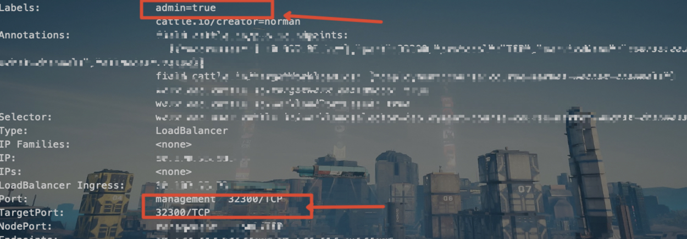

# sample-springboot-admin-with-kubernetes
基于 Kubernetes 服务发现的 Spring-Admin 后端demo。 使用 kubernetes 服务标签来过滤你想在 springboot admin 中管理的那些服务

在Spring Boot Admin中使用JMX来快速执行一些脚本，无需大量投入就可以启用对Java应用程序的管理。

1. 无需大量投入就可以对java应用进行管理
2. 接入简单且基于kubernetes,适合现有部署环境
3. 可视化界面,一个注解就可以把java脚本放到后台进行管理和执行
4. 其他的一些spring-admin的功能

**client的接入方式**

**gradle**:

```groovy
api 'org.springframework.boot:spring-boot-starter-actuator'
implementation 'de.codecentric:spring-boot-admin-starter-client:2.7.0'
```

**配置文件**:

```yaml
spring:
  jmx:
    enabled: true #用jmx端点来暴露和执行脚本
management:
  server:
    port: 25351 #actuator开在另一个端口,防止应用url访问到
  endpoint:
    health:
      show-details: always
  endpoints:
    web:
      exposure:
        include: "*" #暴露给admin后台的端点,可自行选择暴露和不暴露的
```

kubernetes:基于kubernetes的标签来过滤想要加入admin后台的服务,所以需要给service配置下label和需要暴露给admin的端口名,例如:



**给service加上标签 admin=true,将要暴露的端口命名为 management**

可以用来快速新增和执行脚本,注意权限问题


**注意,启动需要配置kubernetes service acount的权限(read,watch)**
